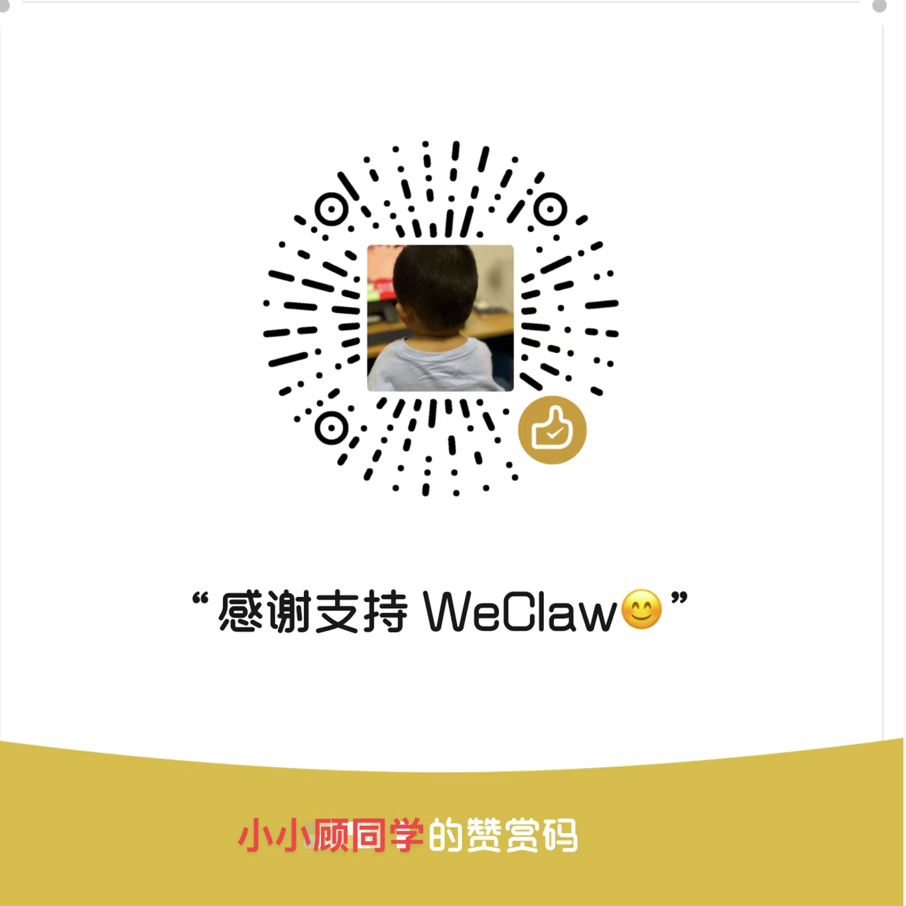

# 🤖 WeClaw

## 1. 介绍

一个精简版、本地优先的个人 AI 助理，通过微信测试号与你对话，拥有终端执行和文件读写能力。

**主要特性：**
- **大模型驱动**：基于硅基流动 (SiliconFlow) 或阿里云百炼提供的大模型服务。
- **本地工具集**：执行终端命令 (bash) 和文件操作 (fs)，让 AI 拥有操作服务器的能力。
- **长期记忆**：基于 SQLite的持久化记忆系统，AI 会记住你的偏好和背景。
- **技能系统**：通过配置 Markdown 文件动态扩展 AI 的专项能力。
- **定时任务**：AI 可自主注册定时任务，主动推送微信提醒。

## 2. 怎么部署

项目提供了一键部署脚本，将本地代码同步到远程服务器并自动使用 PM2 管理服务。

### 第一步：配置环境变量和部署文件
1. 复制环境变量和部署配置模板：
```bash
cp .env.example .env
cp devops/deploy.conf.example devops/deploy.conf
```
2. 编辑 `.env` 文件，填入你的大模型 API Key（支持硅基流动或百炼）及微信测试号配置（AppID、AppSecret、Token）。
3. 编辑 `devops/deploy.conf`，填入你的服务器信息（IP、用户名、密码及远程部署路径）。

### 第二步：一键部署
在本地终端执行脚本（Mac/Linux 环境）：
```bash
./devops/deploy.sh
```
部署脚本会自动将文件同步到服务器，并在远程安装 Node.js 依赖、构建 TypeScript 项目，最后使用 pm2 启动或重启服务。

### 第三步：配置微信公众平台
1. 登录 [微信公众平台测试号管理页](https://mp.weixin.qq.com/debug/cgi-bin/sandbox?t=sandbox/login)。
2. 在“接口配置信息”中填入服务器对应的公网接口地址（如 `http://你的服务器IP:3000/wechat` 或使用反向代理配置好的域名地址）。
3. Token 填写与 `.env` 中 `WECHAT_TOKEN` 一致的值。
4. 点击“提交”验证通过即可。

## 3. 怎么使用

1. **直接对话**：使用微信扫描测试号页面的二维码关注后，直接发消息即可与 AI 互动。
2. **执行服务器命令**：你可以直接让 AI “帮我查看服务器可用内存”或“写一个 python 脚本并运行”，它会通过内置的 bash 工具帮你完成。
3. **增加自定义技能**：在项目的 `config/skills/` 目录下创建 `.md` 文件编写指令，保存后你的 AI 助理即可立刻掌握这门“新技能”（项目内置了如 TickTick 滴答清单管理等功能）。

> **⚠️ 安全提示**：此项目设计为**纯个人使用**。内置的 bash 工具拥有完整的服务器 shell 权限，极其强大但危险，**请勿让不信任的用户关注你的测试号**。

## 4. 打赏

如果这个开源小工具对你有帮助，欢迎打赏喝杯咖啡！



